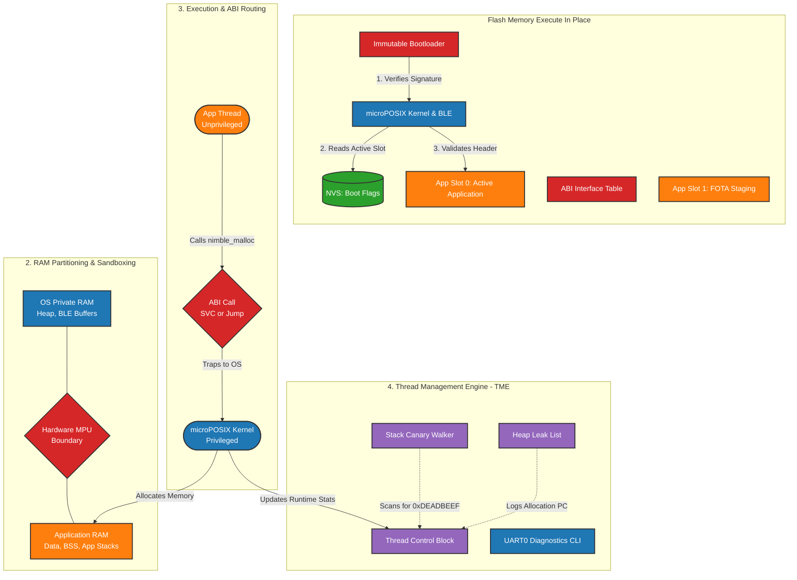

# microPOSIX Resident Kernel 

microPOSIX is a **deterministic, preemptive Resident Kernel RTOS** designed for high-reliability embedded applications. It bridges the gap between traditional monolithic firmware and desktop-class operating systems by implementing a formal **Application Binary Interface (ABI)** and hardware-enforced sandboxing.

---

## System Architecture

The microPOSIX architecture decouples the core OS from the user application, allowing the application to be updated independently via FOTA without jeopardizing the system's core stability.



---

## Hardware Profiles

### Advanced Profile: TI CC2755 (Cortex-M33 @ 90MHz)
- **Privilege Levels**: OS runs in **Privileged Mode**; Application threads run in **Unprivileged Mode**
- **Security**: Hardware **MPU** configures read/execute/write boundaries for App Code, Data, and Stack
- **ABI**: **SVC Router** (Supervisor Calls) traps unprivileged app requests into the kernel
- **Flash**: 1MB total; 448KB for OS, 240KB per App Slot
- **RAM**: 256KB total; 160KB for OS, 64KB for App

### Minimal Profile: TI CC2340R5 (Cortex-M0+ @ 48MHz)
- **Privilege Levels**: Single-level (Logical Sandboxing)
- **ABI**: **System Jump Table** placed at absolute address `0x0003FE00` for zero-overhead OS calls
- **Flash**: 512KB total; 224KB for OS, 128KB per App Slot
- **RAM**: 36KB total; 24KB for OS, 12KB for App

### Nordic nRF54L15 (Dual-Core: Cortex-M33 + RV32)
- **Architecture**: Asymmetric Multi-Processing (AMP) with dual-core support
- **Core 1**: Cortex-M33 with FPU, running microPOSIX instance
- **Core 2**: RISC-V RV32IMAC, running independent microPOSIX instance
- **IPC**: Hardware mailbox, semaphores, and events for inter-core communication
- **Shared Memory**: 64KB shared SRAM for synchronization primitives and thread registry
- **Flash**: 2MB per core (M33: 0x00000000-0x001FFFFF, RV32: 0x01000000-0x011FFFFF)
- **RAM**: 256KB per core + 64KB shared
- **Features**: Cross-core mutexes, barriers, rendezvous, handshake synchronization

### Espressif ESP32 (Xtensa/RISC-V)
- **Architecture**: Single or dual-core (ESP32: Xtensa LX6 dual-core, ESP32-S3/C3: RISC-V)
- **Integration**: Uses **FreeRTOS** as the underlying RTOS
- **ABI**: System Jump Table (SVC not available on Xtensa/RISC-V)
- **Memory**: 4MB+ Flash, 520KB+ RAM (ESP32); 4MB+ Flash, 384-512KB RAM (ESP32-S3/C3)
- **MPU/PMP**: Memory protection via Xtensa MPU or RISC-V PMP
- **Features**: Full thread management, synchronization primitives, GPIO, UART, WDT
- **Compatibility**: See [ESP32 Compatibility Analysis](demo/esp32/COMPATIBILITY_ANALYSIS.md)

---

## Kernel Features

### Core RTOS Features
- **Deterministic Scheduler**: Preemptive priority-based scheduling with 32 levels and priority inheritance
- **POSIX API**: Standard `pthread`, `sem`, `mq`, and `clock` interfaces for portable application development
- **Memory Management**: 
  - **TLSF Allocator**: High-performance, O(1) heap management for variable-size objects
  - **Fixed-Size Pools**: ISR-safe, zero-fragmentation allocation for timing-critical tasks
  - **Leak Tracking**: Allocation headers include Caller PC and Thread ID for precise leak identification
  - **Zero-Copy Memory Views**: Efficient buffer access without copying
  - **Shared Heap**: Thread-safe allocation with mutex protection
  - **Garbage Collection**: Reference counting and mark-and-sweep GC
  - **Memory Arenas**: Bulk allocation and zero-copy slicing

### Thread Management Engine (TME)
- **Stack Watermarking**: Real-time stack health monitoring via `0xAA` pattern scanning
- **CPU Profiling**: DWT cycle-counter-based utilization tracking (Advanced Profile)
- **Watchdog Supervisor**: Per-thread software check-ins linked to hardware WDT

### Advanced Features
- **FOTA Engine**: Integrated signature verification and A/B slot swapping for independent application updates
- **Inter-Core Communication (IPC)**: Mailbox, semaphores, events for multi-core synchronization (nRF54L15)
- **Cross-Core Synchronization**: Mutexes, barriers, rendezvous, handshake (nRF54L15)
- **Serialization Support**: JSON, Protocol Buffers, EDF encoding/decoding

---

## Platform Support

### Fully Supported Platforms

| Platform | Architecture | Cores | MPU/PMP | BLE | Status |
|----------|-------------|-------|---------|-----|--------|
| TI CC2755 | Cortex-M33 | 1 | MPU | BLE5.4 | Production |
| TI CC2340R5 | Cortex-M0+ | 1 | MPU | BLE5.4 | Production |
| Nordic nRF54L15 | Cortex-M33 + RV32 | 2 | MPU | BLE5.4 | Production |
| ESP32 | Xtensa LX6 | 2 | MPU | BLE4.2 | Production |
| ESP32-S3 | RISC-V | 2 | PMP | BLE5.0 | Production |
| ESP32-C3 | RISC-V | 1 | PMP | BLE5.0 | Production |

### Platform-Specific Documentation
- [nRF54L15 Platform Support](platform/nrf54l15/README.md)
- [ESP32 Platform Support](platform/esp32/README.md)
- [ESP32 Demo Application](demo/esp32/README.md)
- [nRF54L15 Demo Application](demo/nrf54l15/README.md)

---

## Resident OS Shell (UART0)

The shell provides a real-time terminal on UART0 (921600 baud) for diagnostics and control.

| Command | Description |
| :--- | :--- |
| `help` | List all available shell commands |
| `top` | Show real-time CPU utilization, state, and Stack HWM per thread |
| `mem` | Report heap usage, free space, and fragmentation metrics |
| `uptime` | System uptime from the 64-bit monotonic clock |
| `kill <tid>` | Safely terminate an application thread |
| `ble stat` | View BLE link statistics, RSSI, and connection intervals |
| `reboot` | Controlled software reset |

---

## Project Structure

```
microPOSIX/
├── include/microposix/
│   ├── kernel/              # Core kernel headers (thread, scheduler, IPC)
│   ├── mm/                 # Memory management (TLSF, pools, gc, arenas)
│   ├── hal/                # Hardware Abstraction Layer
│   │   ├── arm/            # ARM Cortex-M common
│   │   ├── nrf54l15/       # Nordic nRF54L15 (M33 + RV32)
│   │   │   └── shared/     # Shared IPC and synchronization
│   │   └── esp32/          # Espressif ESP32 (Xtensa/RISC-V)
│   ├── ble/                # BLE stack interfaces
│   ├── debug/              # Debug and logging
│   └── serialization/      # JSON, Protocol Buffers, EDF
├── src/
│   ├── kernel/             # Core scheduler, IPC, threading
│   ├── mm/                 # Memory allocators and GC
│   ├── debug/              # UART Shell, Log engine, Fault handlers
│   ├── bootloader/         # Stage-2 loader, FOTA logic
│   └── app_led_blink.c     # Example application
├── platform/
│   ├── arm/                # ARM Cortex-M HAL
│   ├── nrf54l15/           # nRF54L15 platform (M33 + RV32 cores)
│   │   ├── m33/            # Cortex-M33 core files
│   │   ├── rv32/           # RISC-V core files
│   │   └── shared/        # Shared memory and IPC
│   ├── esp32/              # ESP32 platform files
│   ├── riscv/              # RISC-V common
│   └── posix/              # POSIX simulation backend
├── demo/
│   ├── esp32/              # ESP32 demo with blinking LED
│   │   ├── main.c          # Main application
│   │   ├── app_blink.c     # Blinking LED task
│   │   └── README.md       # ESP32 demo documentation
│   └── nrf54l15/           # nRF54L15 dual-core demo
│       ├── main.c          # Main application
│       ├── ipc_test.c      # IPC test functions
│       ├── thread_test.c   # Thread test functions
│       ├── sync_test.c     # Synchronization test functions
│       └── README.md       # nRF54L15 demo documentation
├── tests/                  # Test suite
├── toolchains/             # CMake toolchain files
│   ├── nrf54l15-arm.cmake  # Arm Cortex-M33 toolchain
│   └── nrf54l15-riscv.cmake # RISC-V toolchain
├── docs/                   # Documentation
│   ├── MEMORY_MANAGEMENT.md # Memory management documentation
│   └── ...
├── CHANGES_SUMMARY.md      # Summary of recent changes
├── microPOSIX_Final_Architecture_Document.md
├── README.md               # This file
└── Makefile                # Build system
```

---

## Demo Applications

### ESP32 Demo
The ESP32 demo demonstrates:
- microPOSIX kernel initialization on ESP32
- Thread creation and management
- GPIO control using microPOSIX HAL
- Blinking LED application
- Integration with FreeRTOS

**Quick Start:**
```bash
cd demo/esp32
idf.py set-target esp32
idf.py build
idf.py -p /dev/ttyUSB0 flash monitor
```

**Documentation:** [ESP32 Demo README](demo/esp32/README.md)

### nRF54L15 Demo
The nRF54L15 demo demonstrates:
- Dual-core (Cortex-M33 + RV32) functionality
- Inter-Core Communication (IPC)
- Thread management on both cores
- Synchronization primitives (mutexes, spinlocks, barriers, rendezvous)
- Shared memory access

**Quick Start:**
```bash
# Build M33 core
mkdir build_m33 && cd build_m33
cmake -DCMAKE_TOOLCHAIN_FILE=../toolchains/nrf54l15-arm.cmake \
      -DMICROPOSIX_PLATFORM=nrf54l15 \
      -DMICROPOSIX_CORE_M33=1 \
      ..
make

# Build RV32 core
cd ..
mkdir build_rv32 && cd build_rv32
cmake -DCMAKE_TOOLCHAIN_FILE=../toolchains/nrf54l15-riscv.cmake \
      -DMICROPOSIX_PLATFORM=nrf54l15 \
      -DMICROPOSIX_CORE_RV32=1 \
      ..
make
```

**Documentation:** [nRF54L15 Demo README](demo/nrf54l15/README.md)

---

## Build and Verify

### Prerequisites

#### Common Tools
- `arm-none-eabi-gcc` v12.x+ (for ARM Cortex-M)
- `riscv32-none-elf-gcc` (for RISC-V)
- `make`
- `cmake` (version 3.5+)

#### Platform-Specific Tools
- **ESP32**: [ESP-IDF v5.0+](https://github.com/espressif/esp-idf)
- **nRF54L15**: Nordic nRF5 SDK (optional, for hardware-specific headers)

### Build Commands

#### For TI CC2755 (Cortex-M33)
```bash
make PROFILE=1
```

#### For TI CC2340R5 (Cortex-M0+)
```bash
make PROFILE=0
```

#### For nRF54L15 (Cortex-M33)
```bash
mkdir build && cd build
cmake -DCMAKE_TOOLCHAIN_FILE=../toolchains/nrf54l15-arm.cmake \
      -DMICROPOSIX_PLATFORM=nrf54l15 \
      -DMICROPOSIX_CORE_M33=1 \
      ..
make
```

#### For nRF54L15 (RISC-V)
```bash
mkdir build && cd build
cmake -DCMAKE_TOOLCHAIN_FILE=../toolchains/nrf54l15-riscv.cmake \
      -DMICROPOSIX_PLATFORM=nrf54l15 \
      -DMICROPOSIX_CORE_RV32=1 \
      ..
make
```

#### For ESP32
```bash
cd demo/esp32
idf.py set-target esp32
idf.py build
```

### Verification

Run the integrated test suite on the POSIX simulation backend:
```bash
cd tests && make
```

---

## Recent Changes

### New Features Added

1. **nRF54L15 Dual-Core Support**
   - Full support for Nordic nRF54L15 SoC with Cortex-M33 and RISC-V cores
   - Asymmetric Multi-Processing (AMP) architecture
   - Inter-Core Communication (IPC) layer with mailbox, semaphores, and events
   - Shared memory for thread registry and synchronization primitives
   - Cross-core mutexes, barriers, rendezvous, and handshake synchronization
   - Core-specific context switching (PendSV for M33, software interrupt for RV32)

2. **ESP32 Platform Support**
   - Full support for ESP32, ESP32-S3, and ESP32-C3
   - Integration with FreeRTOS as the underlying RTOS
   - Platform-specific HAL for Xtensa and RISC-V architectures
   - GPIO, UART, WDT, and MPU/PMP drivers
   - Compatibility analysis and workarounds for architecture differences

3. **Advanced Memory Management**
   - Zero-copy memory views and slices
   - Shared heap with thread-safe allocation
   - Garbage collection (reference counting and mark-and-sweep)
   - Memory arenas for bulk allocation
   - Comprehensive memory statistics and tracking

4. **Serialization Support**
   - JSON parsing and generation
   - Protocol Buffers encoding and decoding
   - EDF (Extensible Data Format) serialization

For more details, see:
- [CHANGES_SUMMARY.md](CHANGES_SUMMARY.md)
- [IMPLEMENTATION_SUMMARY.txt](IMPLEMENTATION_SUMMARY.txt)
- [ESP32 Compatibility Analysis](demo/esp32/COMPATIBILITY_ANALYSIS.md)
- [ESP32 Demo Summary](demo/esp32/DEMO_SUMMARY.md)

---

## Documentation

- [microPOSIX Final Architecture Document](microPOSIX_Final_Architecture_Document.md)
- [Memory Management Documentation](docs/MEMORY_MANAGEMENT.md)
- [User Manual for CC2340](USER_MANUAL_CC2340.md)
- [nRF54L15 Platform Support](platform/nrf54l15/README.md)
- [ESP32 Platform Support](platform/esp32/README.md)

---

## License

This project is licensed under the terms specified in the project files.

---

*microPOSIX v2.0 | Developed by Precibel | Updated with nRF54L15 and ESP32 Support*
